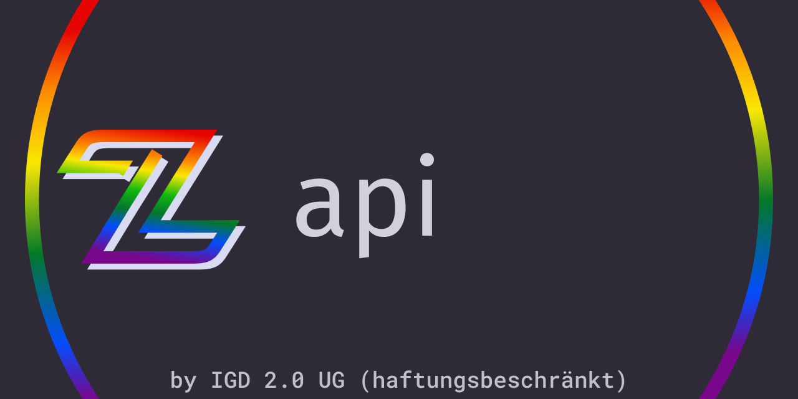

# zwoo-hq/api

Packages containing zwoo api implementations and tools.

## ZRP

The ZRP (Zwoo Request Protocol) is a protocol used for realtime in game communication between the client and the zwoo game server.

If you want to know more about the ZRP, please read the [ZRP documentation](https://zwoo.igd20.de/docs/api/zrp).

Available implementations:

- `@zwoo/api-zrp`: A Typescript/Javascript implementation of the ZRP protocol.
- `Zwoo.Api.ZRP`: A C# implementation of the ZRP protocol.

> ![NOTE]
> Since there is no difference between the protocol usage on the client and server side, these implementations can be used on both sides.